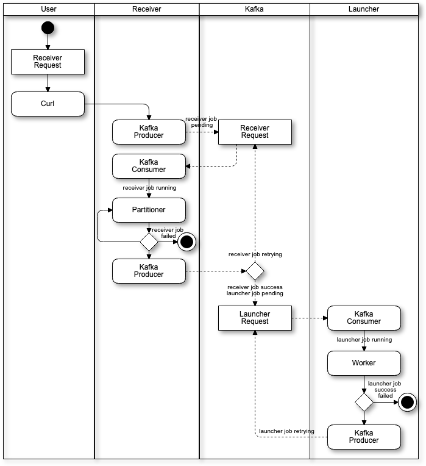

# akka-streams-kafka
## Distributed processing platform using akka-streams-kafka



## Using
1. Launch the verification environment with docker.
```
cd akka-streams-kafka
sbt receiver/compile
sbt receiver/assembly
sbt launcher/compile
sbt launcher/assembly
docker-compose up --build
```
2. You can submit a request to Receiver by curl and execute a job.
It is the example that partitions the request into four and executes the test job.
```
curl -H 'Content-Type:application/json' -d '{"system":"receiver","jobType":"test","options":{"partition-number":4},"partitions":["number"],"retry":0,"retryLimit":0,"operator":1}' 127.0.0.1:5000/run/job 
```

## Receiver
`Receiver` partitions the request by `Partitioner` and queues it to Kafka as a `Launcher` request.
### Partitioner
`Partitioner` partitions the request. For example, `NumberPartitioner` will partition to the number of `PartitionNumber` requested.
#### Partitioner Customization
You can be customize by extended the `Partitioner` trait.
## Launcher
The `Launcher` will execute the requested job on the `Worker`.
### Worker
`Worker` will execute the requested single job.
#### Worker Customization
You can be customize by extended the `Worker` trait.
